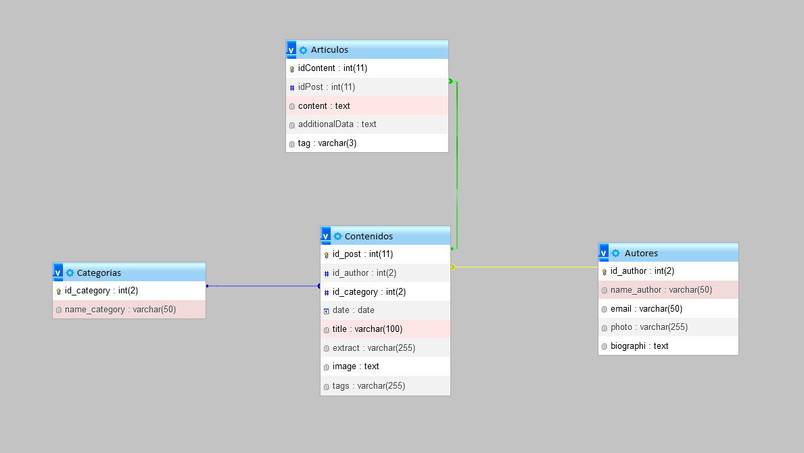

# Simple Blog

Implementación básica de un blog en PHP y MySQL (se puede usar otro motor SQL). Se generó ´./service/dao.php´ el servicio encargado de acceder a la base de datos y recuperar la información a mostrar en la vista.

Las vistas referencian este servicio y se encargan de distribuir la información para que quede correctamente maquetada.

Vale la pena señalar que el modelo de la base de datos sobre el que está pensado este proyecto es el siguiente:

Este repositorio sirve como ejemplo del tutotial publicado en [Blog PC](http://blog.pablocaamano.com.ar)